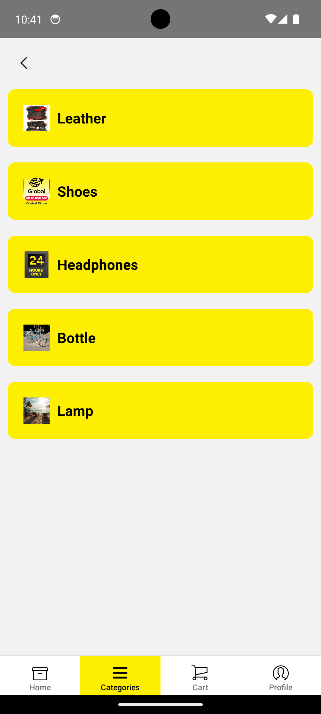
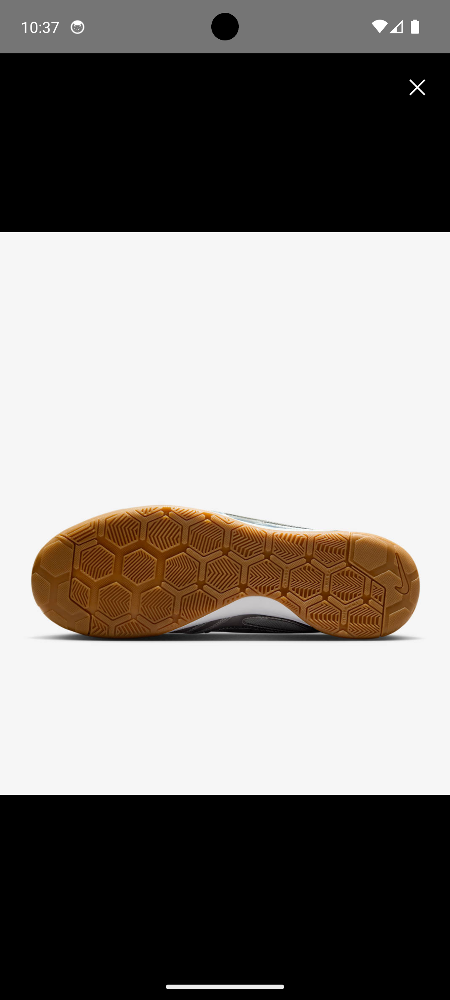
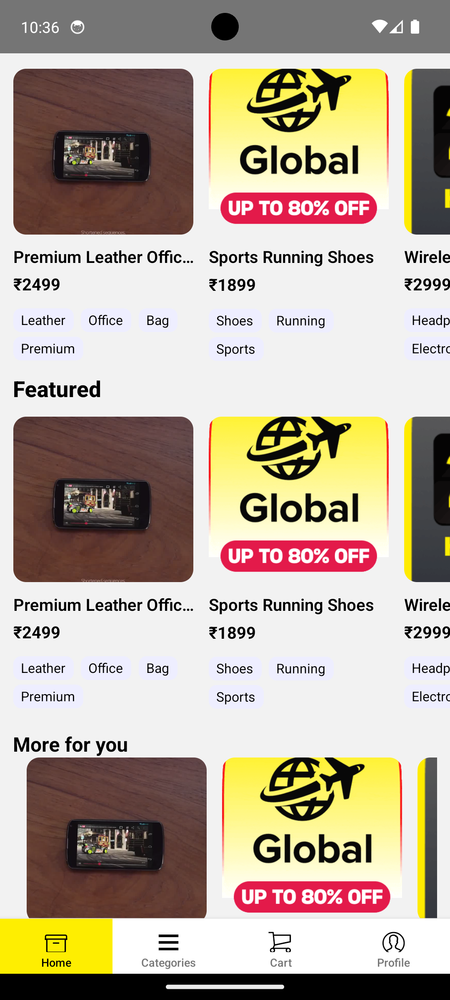
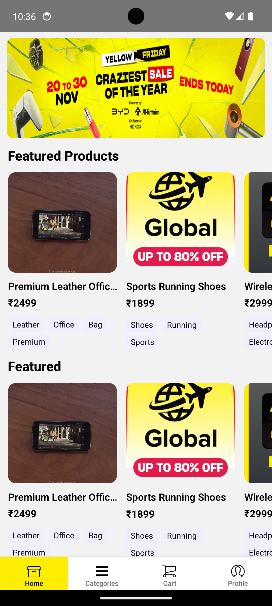

# 🛍️ Eshop – React Native E-Commerce Application

A refined, modular, and performance-optimized **React Native shopping app** built with scalable architecture, persistent state management, SQLite-based offline support, and a clean UI inspired by modern e-commerce experiences.

This project is developed as part of the **React Native Assignment – App Development Challenge** and fulfills all required flows, UI components, and state management rules outlined in the assignment document.

---

## 📱 App Screens & Features

### 🏠 Home Screen
- Dynamic **banner carousel**
- **Multiple horizontal product carousels**
- Smooth scroll with optimized rendering
- Product cards displaying:
  - Image thumbnail  
  - Product name & price  
  - Tags (Free Delivery, Selling Fast, etc.)
  - Shimmer skeleton placeholder while loading  

---

### 📄 Product Details Screen (Fully Modular)
The Product Details page is built using a clean, modular component-based system:

#### 🎥 Media Viewer
- Image + video slider  
- Fullscreen image zoom  
- Fullscreen video modal  
- Auto-play video only when in view  

#### 🧩 Component Blocks
- **TitleSection** (name, rating, price, discount)  
- **OfferStrip**  
- **ColorSelector**  
- **SizeSelector**  
- **DeliverySection** (pincode check, ETA, COD, return policy)  
- **ProductDetailsBlock**:
  - Highlights  
  - Specifications  
  - Warranty  
  - Care Instructions  
  - Full description  
- **TrustBadges**  
- Sticky footer with:
  - Add to Cart  
  - Wishlist toggle  

---

### 🛒 Cart Screen
- Product list  
- Quantity increment/decrement  
- Remove product  
- Auto-calculated price summary  
- Persistent using SQLite  

---

### 🗂 Categories Screen
- Category listing UI  
- Ready for filtering and navigation  

---

### 👤 Profile Screen
- Placeholder for user info  
- Future-ready for address book, orders, wishlist  

---

## ⚙️ Tech Stack

### Frontend
- React Native  
- React Navigation  
- react-native-video  
- react-native-image-viewing  

### State Management
- **Redux Toolkit**  
- **Redux Persist**  
- **SQLite storage** for offline durability  

### Storage
- Cart  
- Wishlist  
- User selections  
→ All saved persistently, even after app kill  

---

## Below are Some Images of the Project

# Categories Screen

# Product Zoom Screen

# Product Detail Screen

# Product Detail Screen

# HomeScreen

# HomeScreen

